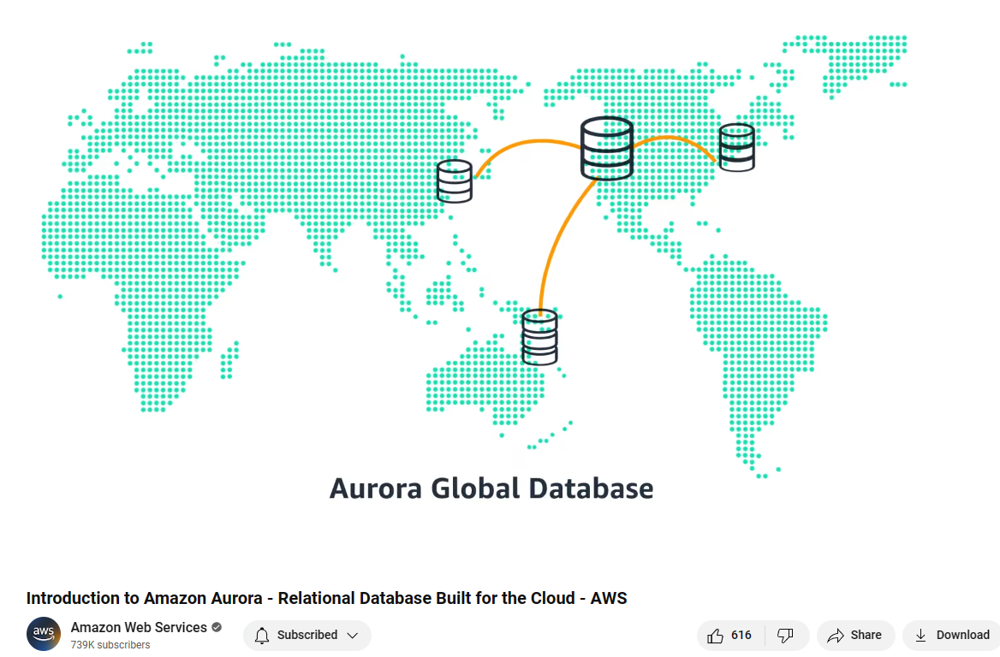
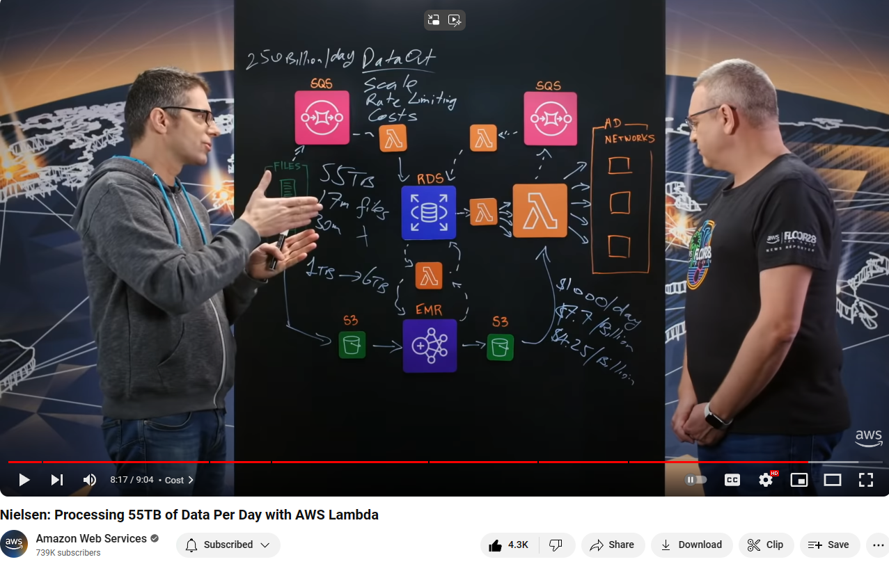

<h1 align="center">AWS Hub ☁️</h1>

Welcome to the AWS Hub Repository 👋

Whether you're a new member of the AWS community or a developer/cloud engineer seeking a centralized document hub for all things AWS, this repository will assist you. Consider this repository as your bookmark for all essential AWS resources, including AWS Certification materials, documentation for AWS services, and AWS Architecture insights. 🔥

## Getting started 🚀

- What is AWS? | Amazon Web Services: ➡️ [**Watch here**](https://youtu.be/a9__D53WsUs)
- AWS Documentation: 📖 [**Explore here**](https://docs.aws.amazon.com)
- Most Important Services: ➡️ [**Watch here**](https://youtu.be/FDEpdNdFglI)
- Top 50+ AWS Services Explained in 10 Minutes: ➡️ [**Watch here**](https://youtu.be/JIbIYCM48to) (by **Fireship**)
- AWS Architecture: 📖 [**Explore here**](https://aws.amazon.com/architecture)
- AWS Management Console: [**Explore here**](https://aws.amazon.com/console/)

<!-- Learning-Resource-Begin -->
<!-- Do not edit the above line manually -->
## AWS Services Learning Resources 📘
This section provides links to detailed documentation, introduction videos, and FAQs for popular AWS services
- **Total services covered:** **42**
- **AWS Docs:** Official documentation for each service
- **AWS FAQs:** Frequently asked questions about AWS services
- **Introduction (Youtube):** AWS short-introduction videos (~2min) with rich animations, music, and diagrams
	- For example: [Introduction to Amazon Aurora](https://youtu.be/FzxqIdIZ9wc)
	  

Full AWS services learning resource table:

| ID | Service Name | AWS Docs | Introduction | AWS FAQs |
|----|--------------|----------|--------------|----------|
| 1 | AWS ACM | 📖 [acm](https://docs.aws.amazon.com/acm) | ▶️ [Watch](https://youtu.be/Nk77te-cksQ) | ❔ [acm/faqs](https://aws.amazon.com/certificate-manager/faqs/)|
| 2 | AWS Appflow | 📖 [appflow](https://docs.aws.amazon.com/appflow/index.html) | ▶️ [Watch](https://youtu.be/6NSxo5syl40) | ❔ [appflow/faqs](https://aws.amazon.com/appflow/faqs/)|
| 3 | AWS Aurora | 📖 [aurora](https://docs.aws.amazon.com/AmazonRDS/latest/AuroraUserGuide) | ▶️ [Watch](https://youtu.be/FzxqIdIZ9wc) | ❔ [aurora/faqs](https://aws.amazon.com/rds/aurora/faqs/)|
| 4 | AWS CloudTrail | 📖 [cloudtrail](https://docs.aws.amazon.com/cloudtrail/) | ▶️ [Watch](https://youtu.be/mXQSnbc9jMs) | ❔ [cloudtrail/faqs](https://aws.amazon.com/cloudtrail/faqs/)|
| 5 | AWS CloudWatch | 📖 [cloudwatch](https://docs.aws.amazon.com/cloudwatch/) | ▶️ [Watch](https://youtu.be/a4dhoTQCyRA) | ❔ [cloudwatch/faqs](https://aws.amazon.com/cloudwatch/faqs/)|
| 6 | AWS Cloudfront | 📖 [cloudfront](https://docs.aws.amazon.com/cloudfront) | ▶️ [Watch](https://youtu.be/AT-nHW3_SVI) | ❔ [cloudfront/faqs](https://aws.amazon.com/cloudfront/faqs/)|
| 7 | AWS CodeCommit | 📖 [codecommit](https://docs.aws.amazon.com/codecommit) | ▶️ [Watch](https://youtu.be/46PRLMW8otg) | ❔ [codecommit/faqs](https://aws.amazon.com/codecommit/faqs/)|
| 8 | AWS Cognito | 📖 [cognito](https://docs.aws.amazon.com/cognito/) | ▶️ [Watch](https://youtu.be/vqAirwfYgrY) | ❔ [cognito/faqs](https://aws.amazon.com/cognito/faqs/)|
| 9 | AWS Config | 📖 [config](https://docs.aws.amazon.com/config/) | ▶️ [Watch](https://youtu.be/MJDuAvNEv64) | ❔ [config/faqs](https://aws.amazon.com/config/faqs/)|
| 10 | AWS ControlTower  | 📖 [controltower](https://docs.aws.amazon.com/controltower) | ▶️ [Watch](https://youtu.be/eOBq__h4OJ4) | ❔ [controltower/faqs](https://aws.amazon.com/controltower/faqs/)|
| 11 | AWS DataSync | 📖 [datasync](https://aws.amazon.com/datasync/) | ▶️ [Watch](https://youtu.be/jPRquig6Nrw) | ❔ [datasync/faqs](https://aws.amazon.com/datasync/faqs/)|
| 12 | AWS DocumentDB | 📖 [documentdb](https://docs.aws.amazon.com/documentdb/) | ▶️ [Watch](https://youtu.be/tkzDp9T8V-k) | ❔ [documentdb/faqs](https://aws.amazon.com/documentdb/faqs/)|
| 13 | AWS DynamoDB | 📖 [dynamodb](https://docs.aws.amazon.com/dynamodb/) | ▶️ [Watch](https://youtu.be/sI-zciHAh-4) | ❔ [dynamodb/faqs](https://aws.amazon.com/dynamodb/faqs/)|
| 14 | AWS EBS | 📖 [ebs](https://docs.aws.amazon.com/ebs/) | ▶️ [Watch](https://youtu.be/77qLAl-lRpo) | ❔ [ebs/faqs](https://aws.amazon.com/ebs/faqs/)|
| 15 | AWS EC2 | 📖 [ec2](https://docs.aws.amazon.com/ec2/) | ▶️ [Watch](https://youtu.be/TsRBftzZsQo) | ❔ [ec2/faqs](https://aws.amazon.com/ec2/faqs/)|
| 16 | AWS ECS | 📖 [ecs](https://docs.aws.amazon.com/ecs/) | ▶️ [Watch](https://youtu.be/FnFvpIsBrog) | ❔ [ecs/faqs](https://aws.amazon.com/ecs/faqs/)|
| 17 | AWS EFS | 📖 [efs](https://docs.aws.amazon.com/efs/) | ▶️ [Watch](https://youtu.be/6ZIPBC78U0s) | ❔ [efs/faqs](https://aws.amazon.com/efs/faq/)|
| 18 | AWS EKS | 📖 [eks](https://docs.aws.amazon.com/eks/) | ▶️ [Watch](https://youtu.be/E956xeOt050) | ❔ [eks/faqs](https://aws.amazon.com/eks/faqs/)|
| 19 | AWS EMR | 📖 [emr](https://docs.aws.amazon.com/emr/) | ▶️ [Watch](https://youtu.be/QuwaBOESGiU) | ❔ [emr/faqs](https://aws.amazon.com/emr/faqs/)|
| 20 | AWS ElastiCache | 📖 [elasticache](https://docs.aws.amazon.com/elasticache/) | ▶️ [Watch](https://youtu.be/GoNsuTqeMto) | ❔ [elasticache/faqs](https://aws.amazon.com/elasticache/faqs/)|
| 21 | AWS Elastic Beanstalk | 📖 [elasticbeanstalk](https://aws.amazon.com/elasticbeanstalk/) | ▶️ [Watch](https://youtu.be/uiM1xzOX8Qg) | ❔ [elasticbeanstalk/faqs](https://aws.amazon.com/elasticbeanstalk/faqs/)|
| 22 | AWS EventBridge | 📖 [eventbridge](https://aws.amazon.com/eventbridge/) | ▶️ [Watch](https://youtu.be/ZfIkcCaPm14) | ❔ [eventbridge/faqs](https://aws.amazon.com/eventbridge/faqs/)|
| 23 | AWS Glue | 📖 [glue](https://aws.amazon.com/glue/) | ▶️ [Watch](https://youtu.be/u14iVEc-C6E) | ❔ [glue/faqs](https://aws.amazon.com/glue/faqs/)|
| 24 | AWS GuardDuty | 📖 [guardduty](https://aws.amazon.com/guardduty/) | ▶️ [Watch](https://youtu.be/ng14ToMXnTA) | ❔ [guardduty/faqs](https://aws.amazon.com/guardduty/faqs/)|
| 25 | AWS IAM | 📖 [iam](https://docs.aws.amazon.com/iam/) | ▶️ [Watch](https://youtu.be/SXSqhTn2DuE) | ❔ [iam/faqs](https://aws.amazon.com/iam/faqs/)|
| 26 | AWS KMS | 📖 [kms](https://docs.aws.amazon.com/kms) | ▶️ [Watch](https://youtu.be/8Z0wsE2HoSo) | ❔ [kms/faqs](https://aws.amazon.com/kms/faqs/)|
| 27 | AWS Kinesis | 📖 [kinesis](https://docs.aws.amazon.com/kinesis/index.html) | ▶️ [Watch](https://youtu.be/MbEfiX4sMXc) | ❔ [kinesis/faqs](https://aws.amazon.com/kinesis/faqs/)|
| 28 | AWS Lake Formation | 📖 [lake-formation](https://aws.amazon.com/lake-formation/) | ▶️ [Watch](https://youtu.be/uVF73MXYay8) | ❔ [lake-formation/faqs](https://aws.amazon.com/lake-formation/faqs/)|
| 29 | AWS Lambda | 📖 [lambda](https://docs.aws.amazon.com/lambda/index.html) | ▶️ [Watch](https://youtu.be/eOBq__h4OJ4) | ❔ [lambda/faqs](https://aws.amazon.com/lambda/faqs/)|
| 30 | AWS Machine Learning | 📖 [machine-learning](https://aws.amazon.com/machine-learning/) | ▶️ [Watch](https://youtu.be/EhExK4JgXvE) | ❔ [machine-learning/faqs](https://aws.amazon.com/faqs/)|
| 31 | AWS OpenSearch | 📖 [opensearch-service](https://aws.amazon.com/opensearch-service/) | ▶️ [Watch](https://youtu.be/cZHB7KBubWs) | ❔ [opensearch-service/faqs](https://aws.amazon.com/opensearch-service/faqs/)|
| 32 | AWS Outposts | 📖 [outposts](https://docs.aws.amazon.com/outposts/index.html) | ▶️ [Watch](https://youtu.be/ppG2FFB0mMQ) | ❔ [outposts/faqs](https://aws.amazon.com/outposts/faqs/)|
| 33 | AWS Pinpoint | 📖 [pinpoint](https://aws.amazon.com/pinpoint/) | ▶️ [Watch](https://youtu.be/qJF1pErxqKQ) | ❔ [pinpoint/faqs](https://aws.amazon.com/pinpoint/faqs/)|
| 34 | AWS QuickSight | 📖 [quicksight](https://docs.aws.amazon.com/quicksight/) | ▶️ [Watch](https://youtu.be/2V1bHRLRG-w) | ❔ [quicksight/faqs](https://aws.amazon.com/quicksight/faqs/)|
| 35 | AWS RDS | 📖 [rds](https://docs.aws.amazon.com/rds) | ▶️ [Watch](https://youtu.be/a4dhoTQCyRA) | ❔ [rds/faqs](https://aws.amazon.com/rds/faqs/)|
| 36 | AWS Route53 | 📖 [route53](https://docs.aws.amazon.com/route53) | ▶️ [Watch](https://youtu.be/RGWgfhZByAI) | ❔ [route53/faqs](https://aws.amazon.com/route53/faqs/)|
| 37 | AWS S3 | 📖 [s3](https://docs.aws.amazon.com/s3) | ▶️ [Watch](https://youtu.be/77lMCiiMilo) | ❔ [s3/faqs](https://aws.amazon.com/s3/faqs/)|
| 38 | AWS SNS | 📖 [sns](https://docs.aws.amazon.com/sns/) | ▶️ [Watch](https://youtu.be/8BEwZnUIZfw) | ❔ [sns/faqs](https://aws.amazon.com/sns/faqs/)|
| 39 | AWS SQS | 📖 [sqs](https://docs.aws.amazon.com/sqs/) | ▶️ [Watch](https://youtu.be/Mw1NVpJsOZc) | ❔ [sqs/faqs](https://aws.amazon.com/sqs/faqs/)|
| 40 | AWS Secrets Manager | 📖 [secrets-manager](https://aws.amazon.com/secrets-manager/) | ▶️ [Watch](https://youtu.be/-9nOyaM3kZk) | ❔ [secrets-manager/faqs](https://aws.amazon.com/secrets-manager/faqs/)|
| 41 | AWS VPC | 📖 [vpc](https://docs.aws.amazon.com/vpc/) | ▶️ [Watch](https://youtu.be/hiKPPy584Mg) | ❔ [vpc/faqs](https://aws.amazon.com/vpc/faqs/)|
| 42 | AWS WAF | 📖 [waf](https://aws.amazon.com/waf/) | ▶️ [Watch](https://youtu.be/nUI7G9UzyN8) | ❔ [waf/faqs](https://aws.amazon.com/waf/faqs/)|

And **more upcoming services content...⏩** you can star/follow this repository to get more up-to-dated content ⭐
<!-- Do not edit the below line manually -->
<!-- Learning-Resource-End -->

## AWS Certification Resources 💯

Preparing for the AWS Certification Exam? Here are my top personal recommendations for learning resources:

### Free Exam Preparation

- Certification exam preparation by AWS: [**here**](https://aws.amazon.com/certification/certification-prep/)
- Check the Exam Guide to understand the purpose and scope and examples of each certification, for example:
  - AWS Certified Solutions Architect - Associate (SAA-C03) Exam Guide: [**here**](https://d1.awsstatic.com/training-and-certification/docs-sa-assoc/AWS-Certified-Solutions-Architect-Associate_Exam-Guide.pdf)
  - AWS Certified Solutions Architect - Associate (SAA-C03) Sample Exam Questions: [**here**](https://d1.awsstatic.com/training-and-certification/docs-sa-assoc/AWS-Certified-Solutions-Architect-Associate_Sample-Questions.pdf)

### Course

- Stephane Maarek: https://www.udemy.com/user/stephane-maarek/
- Jon Bonso: https://www.udemy.com/user/jonjonbonso/
- Adrian Cantrill: https://learn.cantrill.io/
- Youtube freeCodeCamp.org: https://youtu.be/NhDYbskXRgc

### Hands-on/Labs

- Free learn-cantrill-io-labs: https://github.com/acantril/learn-cantrill-io-labs
- Free AWS Cloud Complete Bootcamp Course: https://youtu.be/zA8guDqfv40

### Practice Tests

- Exam Topics - List of all Amazon exams (Free): [**here**](https://www.examtopics.com/exams/amazon/) (E.g: [AWS SAA-C03](https://www.examtopics.com/exams/amazon/aws-certified-solutions-architect-associate-saa-c03/))
- TutorialsDojo Pratice Tests (E.g: [AWS SAA-C03](https://portal.tutorialsdojo.com/courses/aws-certified-solutions-architect-associate-practice-exams/))
- Udemy - Stephane Maarek's Practice Exams (E.g: [AWS SAA-C03](https://www.udemy.com/course/practice-exams-aws-certified-solutions-architect-associate))

### Guides/Cheat Sheets

- Digital Cloud Training- AWS Cheat Sheets: https://digitalcloud.training/aws-cheat-sheets/
- TutorialsDojo - AWS Cheat Sheets: https://tutorialsdojo.com/aws-cheat-sheets/
- Whizlabs - AWS Cheat Sheets: https://www.whizlabs.com/blog/aws-cheat-sheet/

### AWS Services Learning Resources

The link below acts like a bookmark, helping you recap the service via a short introduction video and providing documents, as well as frequently asked questions you could refer to during exam preparation/practice

- Explore [**aws-services-learning-resources**](https://github.com/tungbq/AWSHub/blob/main/README.md#aws-services-learning-resources-)

### AWS Certifications Sub-Reddit

- [**r/AWSCertifications**](https://www.reddit.com/r/AWSCertifications/) brings in your discussions, questions , opinions, news and comments around AWS certifications areas like prep tips, clarifications, lessons learned.

➡️ Explore the [**certification document**](./certification/) for detailed resources on each certification, such as AWS-SAA-C03 and more.

## AWS Architecture ✒️

Discover the architecture of Amazon Web Services, where services seamlessly combine with best practices:

- **This is My Architecture**: An official Youtube video series by AWS that showcases innovative architectural solutions on the AWS Cloud by customers and partners. Each episode examines the most interesting and technically creative elements of each cloud architecture. Watch the series 📺 [**here**](https://youtube.com/playlist?list=PLhr1KZpdzukdeX8mQ2qO73bg6UKQHYsHb)

  - For example: [Nielsen - Processing 55TB of Data Per Day with AWS Lambda](https://youtu.be/Jkx6kVbDpL4)

    

- **AWS Well-Architected Framework:** Learn about AWS best practices for building secure, high-performing, resilient, and efficient infrastructure for your applications. Access the framework 📖 [**here**](https://aws.amazon.com/architecture/well-architected/)

- **AWS Reference Architectures:** Discover pre-designed architecture patterns and best practices for various use cases such as web hosting, big data processing, and more. Explore the reference architectures 📖 [**here**](https://aws.amazon.com/architecture/)

- **AWS Whitepapers:** Dive deeper into AWS services and solutions with technical whitepapers covering architecture, security, performance optimization, and more. Find the whitepapers 📖 [**here**](https://aws.amazon.com/whitepapers/)

## The official YouTube channel AWS 📺

Visit [www.youtube.com/@amazonwebservices](https://www.youtube.com/@amazonwebservices)

- AWS re:Invent 2023: https://youtu.be/UTRBVPvzt9w
- AWS re:Invent 2022: https://youtu.be/RfvL_423a-I
- AWS re:Invent 2021: https://youtu.be/8_Xs8Ik0h1w
- ...and more

## What's Next? ❔

- I'll continue maintaining this repository and updating the resources.
- Stay tuned for more valuable content as I continuously add the latest resources and updates.
- ⏩ You could star ⭐/watch 👀 this repository to stay updated with the latest content!

## Contributing 👋

- See: [CONTRIBUTING.MD](./CONTRIBUTING.md)
- If you find this repository helpful, kindly consider showing your appreciation by giving it a star ⭐ Thanks! 💖
- Looking for the issue to work on? Check the list of our open [**good first issue**](https://github.com/tungbq/AWS-LearningResource/labels/good%20first%20issue) issues
- Feel free to open a new issue if you want to request more content about AWS service learning resource
