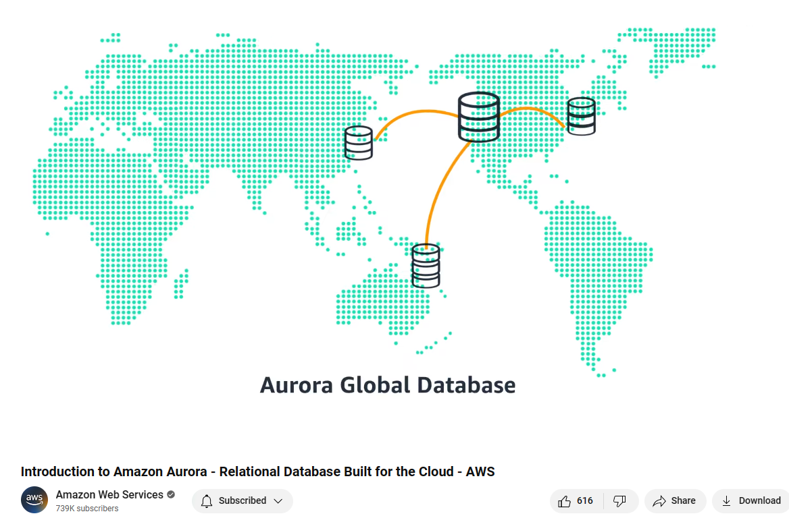

<h1 align="center">AWS Hub ☁️</h1>

Welcome to the AWS Hub Repository 👋

Whether you're a new member of the AWS community or a developer/cloud engineer seeking a centralized document hub for all things AWS, this repository will assist you. Consider this repository as your bookmark for all essential AWS resources, including AWS Certification materials, documentation for AWS services, and AWS Architecture insights. 🔥

## Getting started 🚀

- What is AWS? | Amazon Web Services: ➡️ [**Watch here**](https://youtu.be/a9__D53WsUs)
- AWS Documentation: 📖 [**Explore here**](https://docs.aws.amazon.com)
- Most Important Services: ➡️ [**Watch here**](https://youtu.be/FDEpdNdFglI)
- Top 50+ AWS Services Explained in 10 Minutes: ➡️ [**Watch here**](https://youtu.be/JIbIYCM48to) (by **Fireship**)
- AWS Architecture: 📖 [**Explore here**](https://aws.amazon.com/architecture)
- AWS Management Console: [**Explore here**](https://aws.amazon.com/console/)

<!-- Learning-Resource-Begin -->
<!-- Do not edit the above line manually -->
## AWS Services Learning Resources 📘
This section provides links to detailed documentation, introduction videos, and FAQs for popular AWS services
- **Total services covered:** **43**
- **AWS Docs:** Official documentation for each service
- **AWS FAQs:** Frequently asked questions about AWS services
- **Introduction (Youtube):** AWS short-introduction videos (~2min) with rich animations, music, and diagrams
	- For example: [Introduction to Amazon Aurora](https://youtu.be/FzxqIdIZ9wc)
	  

Full AWS services learning resource table:

| ID | Service Name | AWS Docs | Introduction | AWS FAQs |
|----|--------------|----------|--------------|----------|
| 1 | AWS ACM | 📖 [acm](https://docs.aws.amazon.com/acm) | ▶️ [Watch](https://youtu.be/Nk77te-cksQ) | ❔ [acm/faqs](https://aws.amazon.com/certificate-manager/faqs/)|
| 2 | AWS Appflow | 📖 [appflow](https://docs.aws.amazon.com/appflow/index.html) | ▶️ [Watch](https://youtu.be/6NSxo5syl40) | ❔ [appflow/faqs](https://aws.amazon.com/appflow/faqs/)|
| 3 | AWS Aurora | 📖 [aurora](https://docs.aws.amazon.com/AmazonRDS/latest/AuroraUserGuide) | ▶️ [Watch](https://youtu.be/FzxqIdIZ9wc) | ❔ [aurora/faqs](https://aws.amazon.com/rds/aurora/faqs/)|
| 4 | AWS CloudFormation | 📖 [cloudformation](https://docs.aws.amazon.com/cloudformation/) | ▶️ [Watch](https://youtu.be/Omppm_YUG2g) | ❔ [cloudformation/faqs](https://aws.amazon.com/cloudformation/faqs/)|
| 5 | AWS CloudTrail | 📖 [cloudtrail](https://docs.aws.amazon.com/cloudtrail/) | ▶️ [Watch](https://youtu.be/mXQSnbc9jMs) | ❔ [cloudtrail/faqs](https://aws.amazon.com/cloudtrail/faqs/)|
| 6 | AWS CloudWatch | 📖 [cloudwatch](https://docs.aws.amazon.com/cloudwatch/) | ▶️ [Watch](https://youtu.be/a4dhoTQCyRA) | ❔ [cloudwatch/faqs](https://aws.amazon.com/cloudwatch/faqs/)|
| 7 | AWS Cloudfront | 📖 [cloudfront](https://docs.aws.amazon.com/cloudfront) | ▶️ [Watch](https://youtu.be/AT-nHW3_SVI) | ❔ [cloudfront/faqs](https://aws.amazon.com/cloudfront/faqs/)|
| 8 | AWS CodeCommit | 📖 [codecommit](https://docs.aws.amazon.com/codecommit) | ▶️ [Watch](https://youtu.be/46PRLMW8otg) | ❔ [codecommit/faqs](https://aws.amazon.com/codecommit/faqs/)|
| 9 | AWS Cognito | 📖 [cognito](https://docs.aws.amazon.com/cognito/) | ▶️ [Watch](https://youtu.be/vqAirwfYgrY) | ❔ [cognito/faqs](https://aws.amazon.com/cognito/faqs/)|
| 10 | AWS Config | 📖 [config](https://docs.aws.amazon.com/config/) | ▶️ [Watch](https://youtu.be/MJDuAvNEv64) | ❔ [config/faqs](https://aws.amazon.com/config/faqs/)|
